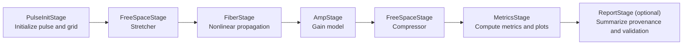

# cpa-sim

_A modular chirped-pulse amplification (CPA) simulation package._

`cpa-sim` is a physics-oriented pipeline for modeling a canonical CPA chain:
**pulse initialization → stretcher → fiber propagation → amplification → compressor → metrics**.

The project is structured to keep stage interfaces stable while allowing backend implementations to evolve (for example, from placeholder deterministic transforms to solver-backed physics models).

## Why this project exists

CPA experiments and design studies need repeatable simulation workflows with:

- consistent units and sign conventions,
- deterministic runs (same config + seed → same summary outputs),
- stage-level provenance and metric reporting,
- test tiers that separate fast contract checks from slower physics regression checks.

`cpa-sim` focuses on those software guarantees first so model fidelity can scale safely over time.

## Stage flow

The default v1 chain is shown below.



## Current implementation snapshot

The repository currently provides:

- a deterministic sequential pipeline builder and runner,
- typed configuration/state models,
- stage registries/backends for laser generation, free-space, fiber, amplification, and metrics,
- test markers for `unit`, `integration`, `physics`, and `slow` workflows.

See `STATUS.md` for progress tracking and release-readiness checklists.

## Installation

### Runtime install

```bash
pip install -e .
```

### Development install

```bash
pip install -e .[dev]
# optional WUST-FOG backend dependency
pip install -e .[gnlse]
```

## Quickstart (CLI first)

### 1) Install

```bash
pip install -e .
```

For development tooling and optional WUST-FOG `gnlse` backend support:

```bash
pip install -e .[dev]
pip install -e .[gnlse]
```

### 2) Run a canonical config from `configs/examples/`

```bash
cpa-sim run configs/examples/basic_cpa.yaml --out out/basic
```

Other canonical examples:

```bash
cpa-sim run configs/examples/tracy_golden.yaml --out out/tracy-golden
# optional: requires the WUST-FOG gnlse dependency
cpa-sim run configs/examples/gnlse_canonical.yaml --out out/gnlse-canonical
```

### 3) Inspect output artifacts

Each run writes these CLI artifacts into `--out`:

- `metrics.json` (overall + per-stage metrics),
- `artifacts.json` (artifact path registry),
- `stage_plots/` with per-stage SVG time-intensity and spectrum plots,
- optional `state_final.npz` when `--dump-state-npz` is passed.

Example with NPZ state dump enabled:

```bash
cpa-sim run configs/examples/basic_cpa.yaml --out out/basic --dump-state-npz
```

### 4) Reproducibility note (fixed seed)

Use a fixed `runtime.seed` in your YAML config to keep summary outputs deterministic for a given config + backend setup. The checked-in configs under `configs/examples/` are intended as stable starting points for reproducible runs.

## Quickstart (Python API, secondary)

```python
from cpa_sim.models import PipelineConfig
from cpa_sim.pipeline import run_pipeline

cfg = PipelineConfig()  # start from deterministic defaults
result = run_pipeline(cfg)

print(result.metrics)
print(result.state.meta)
```

## v1 support matrix

| Stage type | `kind` values available now | Notes |
| --- | --- | --- |
| `laser_gen` | `analytic` | Deterministic pulse/grid initialization backend. |
| `free_space` | `treacy_grating_pair`, `phase_only_dispersion` | Used for stretcher/compressor roles depending on stage placement. |
| `fiber` | `fiber` | Physics/numerics split with `numerics.kind` (`toy_phase` or `wust_gnlse`). |
| `amp` | `simple_gain`, `fiber_amp_wrap` | Simple gain and a fiber amplifier wrapper backend. |
| `metrics` | `standard` | Canonical metrics/artifact recording backend (always final stage in pipeline). |

Related docs:

- Examples: `docs/examples/canonical-1560nm-chain.md`, `docs/examples/wust-gnlse-fiber-example.md`
- ADRs: `docs/adr/ADR-0001-conventions-units.md`, `docs/adr/ADR-0002-result-schema-contract.md`, `docs/adr/ADR-0003-validation-tiers-ci-policy.md`, `docs/adr/ADR-0008-canonical-output-layout.md`

## Configuration model (high-level)

The top-level `PipelineConfig` includes these sections:

- `runtime` (seed and run controls),
- `laser_gen` (initial pulse/beam specification),
- `stretcher` / `compressor` defaults (free-space configs used when `stages` is not set),
- `fiber` (`FiberStageCfg` with stable `physics` plus backend-specific `numerics`),
- `amp` (amplifier backend config; supports `simple_gain` and `fiber_amp_wrap` with `power_out_w` control),
- `stages` (optional arbitrary ordered list of `free_space`, `fiber`, and `amp` stage configs),
- `metrics` (summary metric backend; always appended at pipeline end).

This keeps public configuration stable while backend selection happens per stage via `kind`.

### Runtime config vs stage config vs pipeline policy

- `runtime` is **run-level metadata/control** (for example seed) and is not a processing stage.
- stage configs (`laser_gen`, `stretcher`, `fiber`, `amp`, `compressor`, `metrics`) define model parameters and backend `kind` per stage.
- `policy` is a pipeline-wide override bag passed at execution time for cross-cutting controls (debug/tolerances/instrumentation) without changing stage config shape.

In short: `runtime` and `policy` are global execution concerns, while stage configs define the physical chain itself.

### Configurable stage ordering

`PipelineConfig.stages` allows arbitrary permutations of free-space, fiber, and amp stages.
When omitted, the legacy default order remains `stretcher -> fiber -> amp -> compressor`.
`laser_gen` is always the first stage and `metrics` is always the final stage, so baseline
runs without stretching/compression can be expressed by omitting free-space entries from `stages`.

### Stage plot policy

CLI runs now emit per-stage time/spectrum SVG plots by default into `<out>/stage_plots/`.
If you use the Python API directly, pass runtime policy `{"cpa.emit_stage_plots": true}` and
optionally set `"cpa.stage_plot_dir"`.

### Pulse power/energy inputs and units

Prefer the user-facing pulse normalization fields in config examples:

- `peak_power_w` (direct peak power),
- `avg_power_w` + `rep_rate_mhz` (lab-friendly average power), or
- `pulse_energy_j` (single-pulse energy workflows).

`width_fs` is the pulse **intensity FWHM**. If your source measurement is from an autocorrelator,
provide `intensity_autocorr_fwhm_fs` with a supported `shape` (`gaussian` or `sech2`) and the
simulator will deconvolve to intensity FWHM internally.

Internally, the envelope still uses `sqrt(W)` scaling where `|E(t)|^2` is instantaneous power in W,
and pulse energy is `sum(|E|^2 * dt_fs * 1e-15)` joules.

Legacy compatibility (deprecated): `amplitude` is still accepted but should be migrated to
`peak_power_w`/`avg_power_w`/`pulse_energy_j` in new configs.

For `fiber_amp_wrap`, `power_out_w` is the target **output average power in watts** at the stage output plane.


## Fiber stage example (WUST `gnlse`, Raman-enabled)

Example policy: runnable example logic lives in `src/cpa_sim/examples/*` and is invoked via module entrypoints.

A runnable fiber-stage example module is available at (configured for a **1550 nm, 1 ps** input pulse with Kerr nonlinearity + Raman response):

- `src/cpa_sim/examples/wust_gnlse_fiber_example.py`

Run it with:

```bash
python -m cpa_sim.examples.wust_gnlse_fiber_example --out artifacts/fiber-example --format svg
```

For configuration/units details, see `docs/examples/wust-gnlse-fiber-example.md`.

Canonical end-to-end 1560 nm chain example documentation is at:

- `docs/examples/canonical-1560nm-chain.md`


## Outputs and provenance

`cpa-sim run ... --out <dir>` uses this canonical output layout:

- `metrics.json` (schema `cpa.metrics.v1`)
  - `overall`: aggregate flat metric map
  - `per_stage`: stage-grouped metric map
- `artifacts.json` (schema `cpa.artifacts.v1`)
  - `paths`: artifact-name to file-path map
- `stage_plots/`
  - `<stage>_time_intensity.svg`
  - `<stage>_spectrum.svg`
- `state_final.npz` (optional via `--dump-state-npz`)

A run returns a `StageResult` with deterministic `state`, `metrics`, and provenance metadata in `state.meta`.

## Validation strategy

The test strategy follows tiered validation:

- **Unit tests** for schema contracts and invariants,
- **Integration tests** for end-to-end tiny-chain execution,
- **Physics tests** for canonical/golden targets (tracked as roadmap work),
- **Slow tests** for larger or longer-running scenarios.

Common local commands:

```bash
python -m pre_commit run -a
python -m mypy src
python -m pytest -q -m "not slow and not physics" --durations=10
```

## Repository layout

```text
src/cpa_sim/
  models/            # configuration, state, provenance models
  stages/            # stage interfaces + backend implementations
  pipeline.py        # chain assembly and deterministic execution entrypoint

tests/
  unit/              # fast contract/invariant tests
  integration/       # fast end-to-end smoke tests
  physics/           # canonical physics regression tests
```

## Roadmap themes

Near-term focus areas include:

1. maturing physics backends and canonical reference cases,
2. expanding artifact/report generation,
3. hardening schema/contract documentation,
4. introducing a stable CLI workflow.

For concrete status, see `STATUS.md` and ADRs in `docs/adr/`.

## Contributing

Before opening a PR, run required quality gates:

```bash
python -m pre_commit run -a
python -m mypy src
python -m pytest -q -m "not slow and not physics" --durations=10
```

Keep docs and status files synchronized when behavior changes.

## License

See `LICENSE`.
