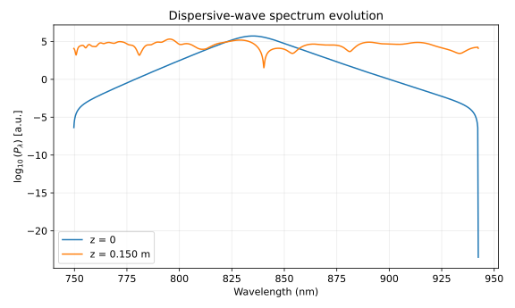
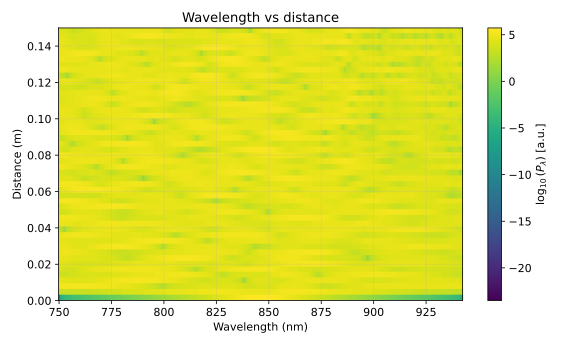
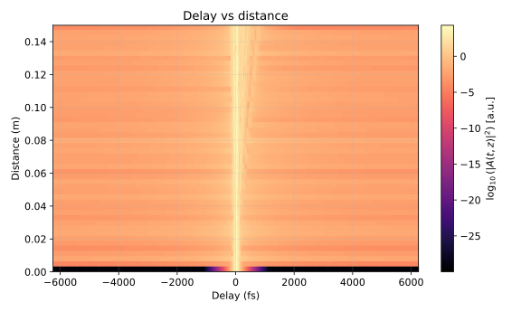

# GNLS dispersive-wave showcase (835 nm)

This page documents the 835 nm anomalous-dispersion dispersive-wave scenario used in the
`python -m cpa_sim.examples.gnlse_dispersive_wave` workflow.

The setup mirrors the `gnlse-python` dispersive-wave / Raman showcase style: a short sech² pulse
propagates through nonlinear fiber with higher-order dispersion, Raman response, and
self-steepening enabled so phase-matched short-wavelength dispersive-wave content appears in the
output spectrum.

## Reproduce

```bash
python scripts/build_docs_assets.py --mode ci
```

For PR-safe docs builds (no optional gnlse dependency required), use:

```bash
python scripts/build_docs_assets.py --mode ultra-fast --allow-missing-gnlse
```

## Generated assets

Expected output directory:

- `docs/assets/generated/gnlse-dispersive-wave/`

Expected filenames:

- `spectrum_z0_vs_zL.svg`
- `evolution_wavelength_vs_distance.svg`
- `evolution_delay_vs_distance.svg`

### Spectrum (z = 0 vs z = L)



### Wavelength vs propagation distance



### Time delay vs propagation distance


