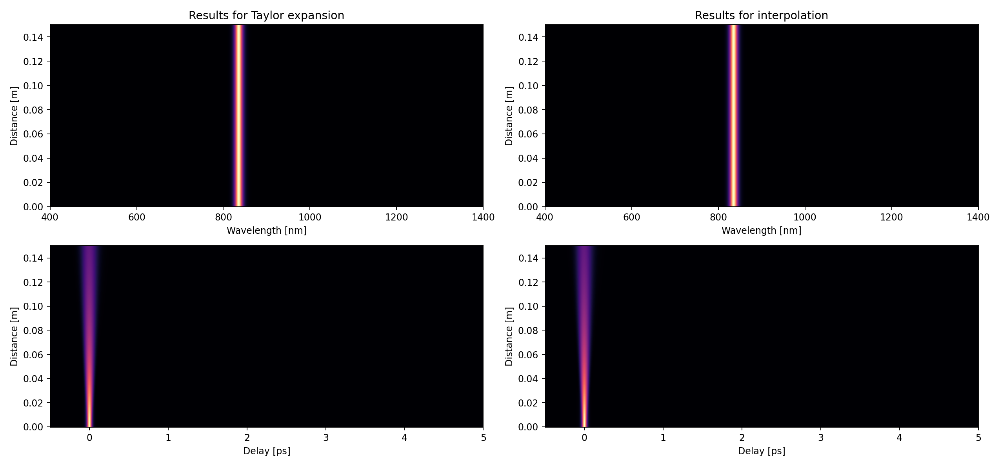
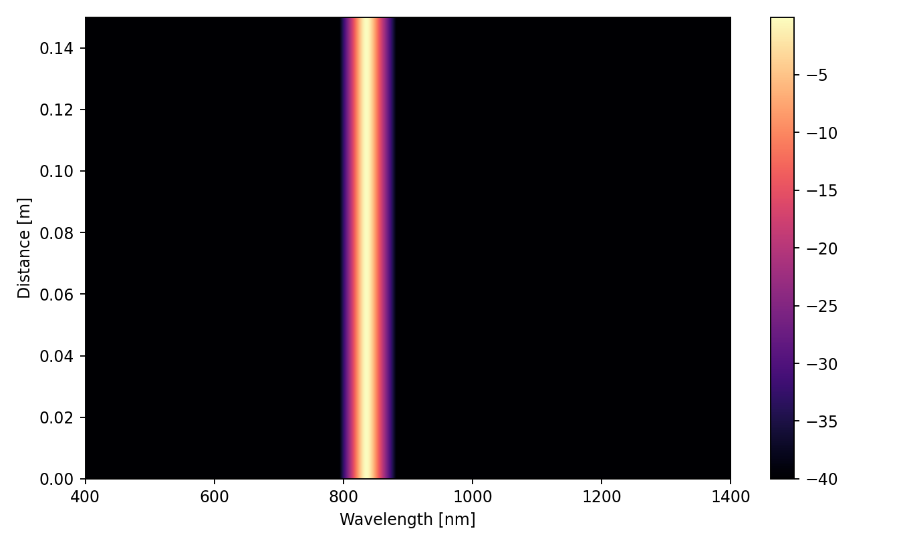
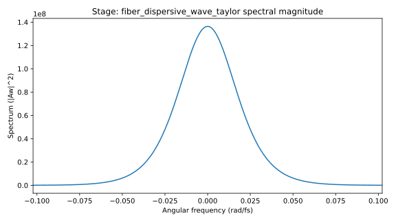
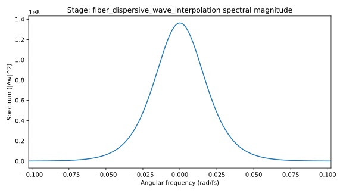

# gnlse dispersive-wave showcase (WUST `test_dispersion` parity)

This example reproduces the same physics setup as WUST-FOG gnlse `examples/test_dispersion.py`:

- Case 1: Taylor dispersion operator.
- Case 2: Interpolated dispersion from the `neff_pcf` table.

The script keeps cpa-sim's canonical output layout while producing WUST-style comparison maps.

## Prerequisites

```bash
pip install -e .[dev,gnlse]
```

## Run

Run both cases (default):

```bash
python -m cpa_sim.examples.gnlse_dispersive_wave_showcase --out out --preset dispersion --case both
```

Run one case only:

```bash
python -m cpa_sim.examples.gnlse_dispersive_wave_showcase --out out --preset dispersion --case taylor
python -m cpa_sim.examples.gnlse_dispersive_wave_showcase --out out --preset dispersion --case interpolation
```

## Fixed upstream-matching values

- Pulse/grid: `shape="sech2"`, `peak_power_w=10000.0`, `width_fs=50.0`, `center_wavelength_nm=835.0`, `n_samples=16384`, `time_window_fs=12500.0`
- Fiber: `length_m=0.15`, `loss_db_per_m=0.0`, `gamma_1_per_w_m=0.0`, `self_steepening=True`, `raman.model="blowwood"`
- Taylor betas:
  - `-0.024948815481502`
  - `8.875391917212998e-05`
  - `-9.247462376518329e-08`
  - `1.508210856829677e-10`
- Numerics: `backend="wust_gnlse"`, `z_saves=200`, `keep_full_solution=True`
- WUST-style plotting windows: wavelength `[400.0, 1400.0] nm`, delay `[-0.5, 5.0] ps`

## Output layout

After running, artifacts are written under `out/`:

- `out/metrics.json`
- `out/artifacts.json`
- `out/stage_plots/`

Case-specific stems:

- `fiber_dispersive_wave_taylor_*`
- `fiber_dispersive_wave_interpolation_*`

Combined comparison (when `--case both`):

- `out/stage_plots/fiber_dispersive_wave_comparison_wust.png`

## Generated reference plots

Committed docs assets for this showcase live in:

- `docs/assets/generated/gnlse-dispersive-wave-showcase/`

### WUST-style combined comparison



### Wavelength maps (log scale)




### Output spectra




## Interpolation data provenance

The interpolation case uses a checked-in deterministic table:

- `src/cpa_sim/examples/data/neff_pcf_dat01.csv`

This CSV was extracted once from WUST-FOG gnlse `data/neff_pcf.mat` using the same columns consumed in upstream `examples/test_dispersion.py` (`dat[:,0]` and `dat[:,1]`).
