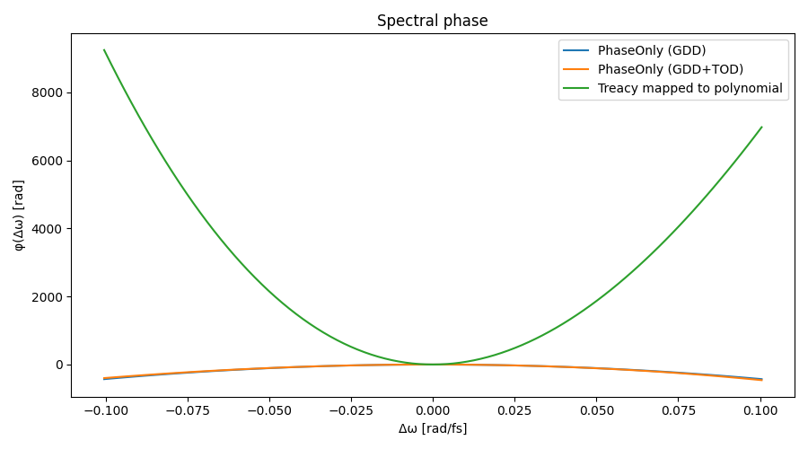
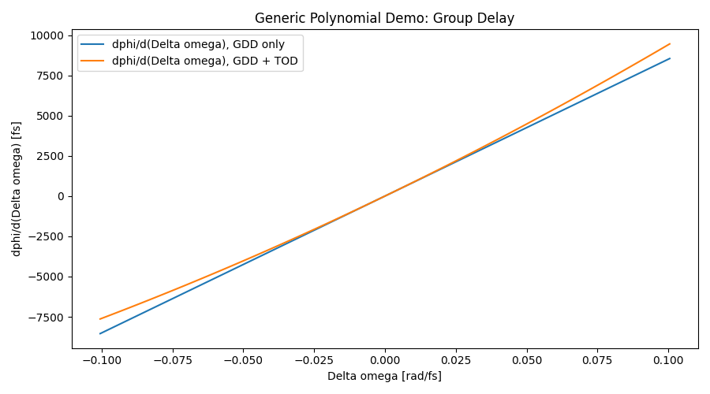
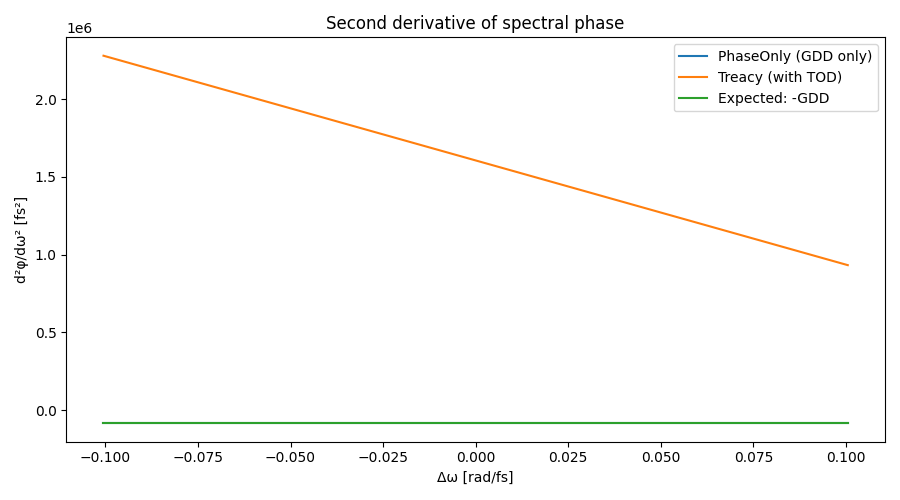
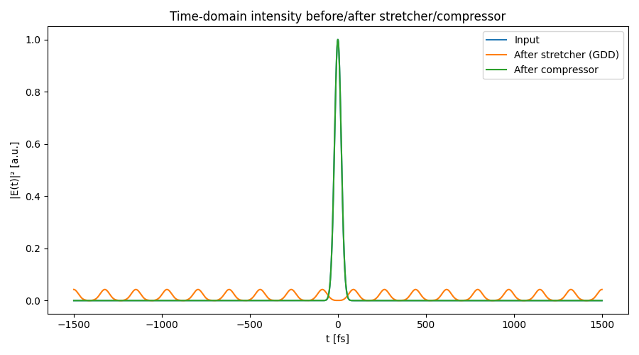
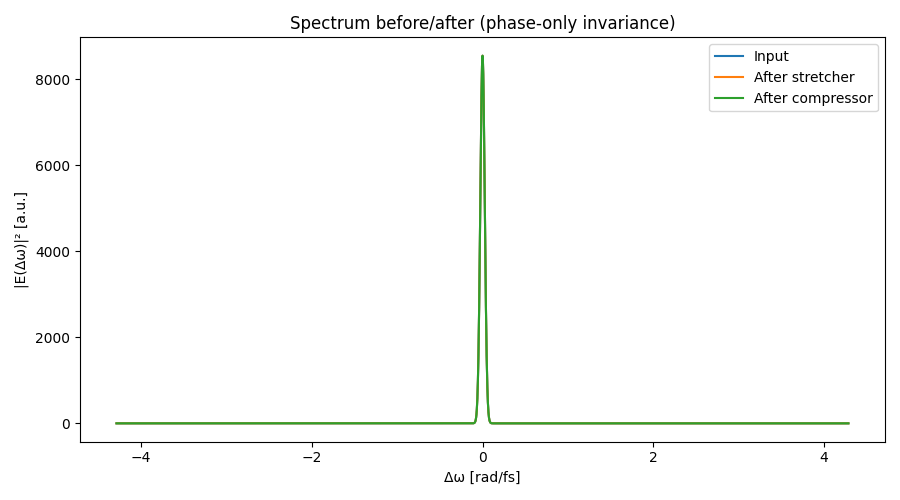
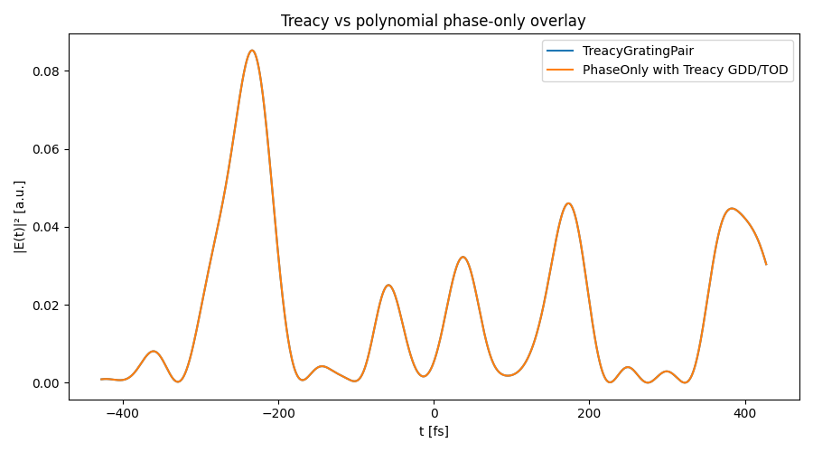

# Treacy stage validation

This page documents reproducible validation artifacts for the free-space dispersion stage.
The model used here is a **phase-only spectral operator on the envelope**, where the stage applies

a phase \(\phi(\Delta\omega)\) directly on the offset-frequency grid, and the simulator’s
`w` axis is \(\Delta\omega\) (not absolute optical carrier frequency).

## What was validated

- Treacy GDD/TOD scalar correctness from geometry (covered by existing tests).
- Correct application of \(\phi(\Delta\omega)\) to the field (new derivation/plot evidence).
- Analytic Gaussian broadening benchmark under phase-only dispersion.
- Treacy vs `PhaseOnlyDispersion` equivalence when TOD is enabled and coefficients are matched.

## Validation plots

### Spectral phase and derivatives







### Time and spectral domain pulse behavior





### Treacy vs polynomial phase-only equivalence



## How to regenerate

From the repository root:

```bash
python -m cpa_sim.examples.treacy_stage_validation
```

The script writes PNG artifacts to `docs/assets/treacy_validation/` and prints a short summary
including RMS durations and recovered GDD/TOD estimates from numerical derivatives.
